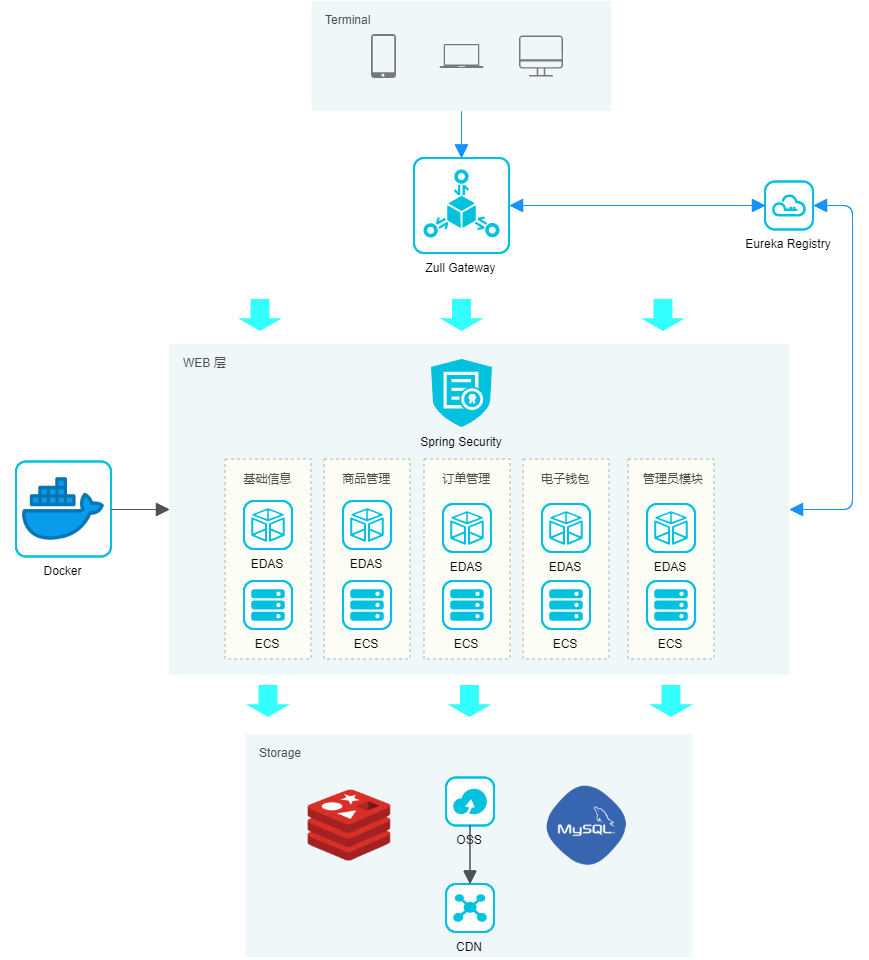

<center><image src="document/orange-brand-big.png"></image></center>

<center><image src="https://img.shields.io/badge/后端项目-e--commerce--back-brightgreen.svg"></image><image src="https://img.shields.io/badge/前端项目-e--commerce--front-orange.svg"></image><image src="https://img.shields.io/badge/东北大学-实训大作业-red.svg"></image></center>

## 项目介绍

`e-commerce`为2020年东北大学软件学院英语国际专业于东软睿道进行的实训项目：跨境电商品平台，简称ECO。

ECO跨境电商平台系统，包含基本的注册登录业务，此外本系统将用户分为两类：借卖方用户、品牌商用户。对于品牌方用户，系统支持信息管理、商品管理、订单管理、钱包等业务；对于借卖方用户，系统支持信息管理、商品浏览、心愿单、订单管理、钱包等业务。此外，为了管理用户，还需要管理员，对于管理员，系统支持管理员对用户的权限管理、对菜单的管理、对参数字典的管理、对交易的审核等业务。

本项目由5位大三同学历时2周半进行开发。我们仍才疏学浅，虚心听候大家的批评指正，同时也希望该项目能够帮助到他人。

## 系统架构图



## 类与对象设计


## 前端组织结构

```lua
e-commerce-front
 ├── src
	├── api -- 通用接口
	├── assets -- 图片
	├── components -- 公用组件
	├── icons -- 图标
	├── layout -- 布局组件
	├── network -- 所有网络请求
	├── router -- 路由
	├── store -- Vuex
	├── sytles -- 样式
	├── utils -- 工具类
	├── views -- 界面视图
```

前端项目依靠 [vue-element-admin](https://github.com/PanJiaChen/vue-element-admin)项目进行搭建，借鉴了其目录结构、样式等等，十分感谢该项目及该项目的作者！

## 后端组织结构

```lua
e-commerce
├── e-commerce-admin -- 管理员微服务模块
├── e-commerce-basicInfo -- 基础信息管理微服务模块
├── e-commerce-wallet -- 钱包微服务模块
├── e-commerce-order -- 订单微服务模块
├── e-commerce-product -- 商品微服务模块
├── e-commerce-common -- 工具类及通用代码模块
├── e-commerce-mybatis -- mybatis generator生成的DAO层代码
├── e-commerce-redis -- redis缓存工具类
├── e-commerce-security -- spring security模块
└── e-commerce-zuul -- 网关模块
```

后端项目使用微服务架构，并且将不同模块间相互依赖。

后端项目中并不包含注册中心部分代码，注册中心在项目开发之初便打包为Docker镜像部署在服务器上。（Eureka）数据库文件与注册中心单独放于后端其他文件夹中。

## 项目展示

#### **登录界面**


#### 商品主图界面


#### 商品详情界面


#### 菜单管理界面


#### 修改角色权限


## 技术选型

#### 前端技术

| 技术       | 说明             | 官网                           |
| ---------- | ---------------- | ------------------------------ |
| Vue        | 前端框架         | https://vuejs.org/             |
| Vue-router | 路由框架         | https://router.vuejs.org/      |
| Vuex       | 全局状态管理框架 | https://vuex.vuejs.org/        |
| Element    | 前端UI框架       | https://element.eleme.io/      |
| Axios      | 前端HTTP框架     | https://github.com/axios/axios |

#### 后端技术

| 技术             | 说明                | 官网                                           |
| ---------------- | ------------------- | ---------------------------------------------- |
| Spring Cloud     | 微服务框架          | https://spring.io/projects/spring-cloud        |
| Spring Boot      | 容器+MVC框架        | https://spring.io/projects/spring-boot         |
| Spring Security  | 认证和授权框架      | https://spring.io/projects/spring-security     |
| MyBatis          | ORM框架             | http://www.mybatis.org/mybatis-3/zh/index.html |
| MyBatisGenerator | 数据层代码生成      | http://www.mybatis.org/generator/index.html    |
| PageHelper       | MyBatis物理分页插件 | http://git.oschina.net/free/Mybatis_PageHelper |
| Swagger-UI       | 文档生产工具        | https://github.com/swagger-api/swagger-ui      |
| RabbitMq         | 消息队列            | https://www.rabbitmq.com/                      |
| Redis            | 分布式缓存          | https://redis.io/                              |
| Docker           | 应用容器引擎        | https://www.docker.com/                        |
| Druid            | 数据库连接池        | https://github.com/alibaba/druid               |
| OSS              | 对象存储            | https://github.com/aliyun/aliyun-oss-java-sdk  |
| JWT              | JWT登录支持         | https://github.com/jwtk/jjwt                   |
| Lombok           | 简化对象封装工具    | https://github.com/rzwitserloot/lombok         |
| Jenkins          | 自动化部署工具      | https://github.com/jenkinsci/jenkins           |
| Hutool           | Java工具类库        | https://www.hutool.cn                          |

## 启动方式

#### 前端启动

```bash
# Install dependencies
npm install

# Serve with hot reload at localhost:9528
npm run dev

# Build for production with minification
npm run build
```

#### 后端启动

您首先需要启动Admin微服务模块，这样才能够获得验证码、验证权限并进入整个系统中。

用户名和密码：

- admin string
- bvo string
- mvo string

## 特别感谢

感谢东北大学软件学院的培养、感谢东软睿道集团的辛勤教导、感谢团队五位同学（张同学、陈同学、年同学、邱同学、马同学）的大力支持！

## 联系我们

如果您需要该项目的需求分析文档、我（马同学）的总结报告等相关文档或者有任何批评指正，您可以通过mahhss@foxmail.com联系我。

## 许可证

[Apache License 2.0](https://github.com/Mahongsheng/e-commerce/LICENSE)
